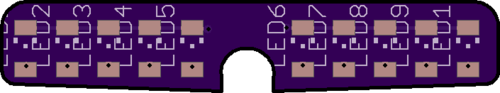
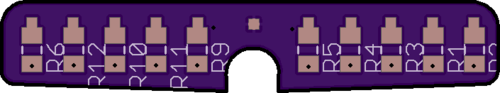
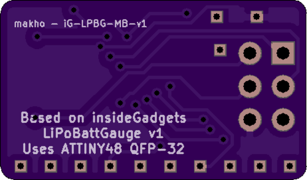

# iG-LiPo-Battery-Gauge
Modified version of https://github.com/insidegadgets/LiPo-Battery-Gauge

I made this because I accidentally ordered the wrong ATTINYs and it was cheaper to make new custom PCBs than to order the correct MCUs. I also tweaked the LED board that Alex uploaded to comply with OSHpark's minimum size requirements. 

## LED Board

I've uploaded the tweaked EAGLE BRD file and uploaded the exported gerbers if you want to use a different manufacturer. This PCB fits nicely in a GBA right below the LCD. See [my youtube video](https://www.youtube.com/watch?v=7A705K_WF-E) for more info on the install and usage.

[Order the LED board here](https://oshpark.com/shared_projects/lczB1jHZ)

## Main Board

I recreated the original main board for use with a different size ATTINY. This is functionally identical to Alex's board and other than the ATTINY, it uses the exact same parts. You can also solder resistors and LEDs straight to this board but I think some tweaks to this board would make that a lot easier. 
[Order the LED board here](https://oshpark.com/shared_projects/lczB1jHZ)

## BOM

The BOM (Bill of Materials) is inside the EAGLE schematic files for the original PCBs ([see the linked repo](https://github.com/insidegadgets/LiPo-Battery-Gauge)) but I'll sum everything up for you: 

LED Board
* 10x 10k SMT 0805 resistors (or 0603, both fit fine)
* 10x 1206 SMT LEDs in whatever color you want

Main Board
* 3x 0603 0.1uF capacitors
* 1x 10K 0603 resistor (R6)
* 1x 320K 0603 resistor (R7) (though the firmware I uploaded is for if you use a 300k resistor instead)
* 1x 1M 0603 resistor (R2)
* 1x ATTINY48 VQFN-28 package. 

## Firmware 

The firmware in this repo is for if you use a 300k resistor instead of a 320k resistor. Otherwise, your gauge will estimate incorrectly. I have also tweaked the firmware to change the scale so that nearly full charge illumunates all 10 LEDs and nearly empty charge disabled all 10 LEDs. It should scale somewhat linearly but battery voltage curves can be weird. 

Editing the firmware? Good luck. I added comments for the SP version of the firmware regarding the values I tweaked. I did not do the same for the GBA version as I didn't intend on sharing it. My bad. I used ubuntu for editing and recompiling. I've also already tweaked the makefiles so once you have all the dependencies, you'll just need to run make and take the .hex file and flash that to your ATTINY with avrdude. If compiling with Windows, you'll have to edit the makefile to include the location of the binaries or just add all the binaries to your PATH file. 

As far as flashing the firmware goes, I used avrdude, a USBasp, and Windows for that. I used zadig to install the libusb-win32 driver for my USBasp instead of the default one Windows installs. Otherwise, avrdude won't recognize the USBasp. Once setup, you'll need to download avrdude and the main.hex file from the insideGadgets repo or my repo and run the following command: .\avrdude.exe -c usbasp -p attiny48 -u -U flash:w:main.hex and you'll probably have to add some lines to your avrdude.conf file just to get it flash an attiny48. This worked for me: https://lists.nongnu.org/archive/html/avrdude-dev/2009-08/msg00005.html

I've also attached my avrdude.conf file for reference. It needs to be in the same directory as avrdude to work. 
